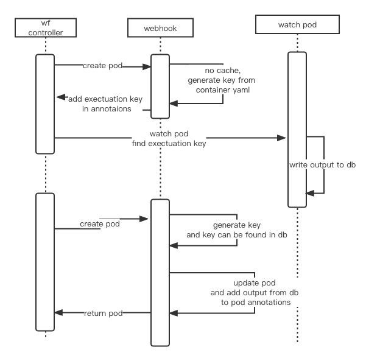

# pipeline cache
新版本pipeline存在缓存功能，他会把pod的输出接口写到db中，当重新执行pod时，如果发现container未发生任何改变时，pipeline会直接从db中获取结果，对应pod会执行一条echo命令"echo This step output is taken from cache."
先大致画了时序图

首先wf controller创建pod之后，会先经过一个webhook，该webhook会根据container内容生成一个key，然后从数据库中找，未发现缓存之后，
将该key写入label中（图中写错了）。然后正常的pod的已经正常运行。同时cache server中会watch该类pod，带pod completed之后，
会将该output、key、过期时间等信息写入db中。
    
等新创建一个pod后，webhook根据container生成的key发现在db中可以找到且没有过期，则会直接从db中获取输出结果。
然后修改当前pod，运行一个busybox，打印一条日志。然后结束
先看webhook代码
```
func MutatePodIfCached(req *v1beta1.AdmissionRequest, clientMgr ClientManagerInterface) ([]patchOperation, error) {
	.........
	// 生成key
	executionHashKey, err := generateCacheKeyFromTemplate(template)
	log.Println(executionHashKey)
	if err != nil {
		log.Printf("Unable to generate cache key for pod %s : %s", pod.ObjectMeta.Name, err.Error())
		return patches, nil
	}
	// 放到annotation中
	annotations[ExecutionKey] = executionHashKey
	labels[CacheIDLabelKey] = ""
	var maxCacheStalenessInSeconds int64 = -1
	// 获取过期时间，默认-1，永不过时
	maxCacheStaleness, exists := annotations[MaxCacheStalenessKey]
	if exists {
		maxCacheStalenessInSeconds = getMaxCacheStaleness(maxCacheStaleness)
	}

	var cachedExecution *model.ExecutionCache
	// 获取缓存中的key，看是否存在缓存
	cachedExecution, err = clientMgr.CacheStore().GetExecutionCache(executionHashKey, maxCacheStalenessInSeconds)
	if err != nil {
		log.Println(err.Error())
	}
	// Found cached execution, add cached output and cache_id and replace container images.
	// 找到了缓存，去缓存结果
	if cachedExecution != nil {
		
		image := "gcr.io/google-containers/busybox"
		if v, ok := os.LookupEnv("CACHE_IMAGE"); ok {
			image = v
		}
		dummyContainer := corev1.Container{
			Name:    "main",
			Image:   image,
			Command: []string{`echo`, `"This step output is taken from cache."`},
		}
		dummyContainers := []corev1.Container{
			dummyContainer,
		}
		patches = append(patches, patchOperation{
			Op:    OperationTypeReplace,
			Path:  SpecContainersPath,
			Value: dummyContainers,
		})
		node_restrictions, err := getEnvBool("CACHE_NODE_RESTRICTIONS")
		if err != nil {
			return nil, err
		}
		if !node_restrictions {
			if pod.Spec.Affinity != nil {
				patches = append(patches, patchOperation{
					Op:   OperationTypeRemove,
					Path: "/spec/affinity",
				})
			}
			if pod.Spec.NodeSelector != nil {
				patches = append(patches, patchOperation{
					Op:   OperationTypeRemove,
					Path: "/spec/nodeSelector",
				})
			}
		}
		if pod.Spec.InitContainers != nil || len(pod.Spec.InitContainers) != 0 {
			patches = append(patches, patchOperation{
				Op:   OperationTypeRemove,
				Path: SpecInitContainersPath,
			})
		}
	}

	// Add executionKey to pod.metadata.annotations
	patches = append(patches, patchOperation{
		Op:    OperationTypeAdd,
		Path:  AnnotationPath,
		Value: annotations,
	})

	// Add cache_id label key
	patches = append(patches, patchOperation{
		Op:    OperationTypeAdd,
		Path:  LabelPath,
		Value: labels,
	})

	return patches, nil
}

```
所以webhook中会给每个kubeflow的pod进行一定处理，第一次创建会根据contain信息生成一个key，然后watch pod中会watch到这个key，
将输出结果写到db中。 当重新生成一个pod时，会在进入webhoook，根据container信息重新生成key，发现key值
匹配则从db中直接将结果获取。
可以看watch pod代码。
```
func WatchPods(ctx context.Context, namespaceToWatch string, clientManager ClientManagerInterface) {
	k8sCore := clientManager.KubernetesCoreClient()

	for {
		listOptions := metav1.ListOptions{
			Watch:         true,
			LabelSelector: CacheIDLabelKey,
		}
		watcher, err := k8sCore.PodClient(namespaceToWatch).Watch(ctx, listOptions)

		if err != nil {
			log.Printf("Watcher error:" + err.Error())
		}
		// 不断watch
		for event := range watcher.ResultChan() {
			pod := reflect.ValueOf(event.Object).Interface().(*corev1.Pod)
			if event.Type == watch.Error {
				continue
			}
			log.Printf((*pod).GetName())
			// pod执行完才处理
			if !isPodCompletedAndSucceeded(pod) {
				log.Printf("Pod %s is not completed or not in successful status.", pod.ObjectMeta.Name)
				continue
			}

			.......

			executionKey, exists := pod.ObjectMeta.Annotations[ExecutionKey]
			if !exists {
				continue
			}

			executionOutput, exists := pod.ObjectMeta.Annotations[ArgoWorkflowOutputs]

			executionOutputMap := make(map[string]interface{})
			executionOutputMap[ArgoWorkflowOutputs] = executionOutput
			executionOutputMap[MetadataExecutionIDKey] = pod.ObjectMeta.Labels[MetadataExecutionIDKey]
			executionOutputJSON, _ := json.Marshal(executionOutputMap)
			// 获取过期时间，默认-1，永不过期，0为禁用禁用缓存
			executionMaxCacheStaleness, exists := pod.ObjectMeta.Annotations[MaxCacheStalenessKey]
			var maxCacheStalenessInSeconds int64 = -1
			if exists {
				maxCacheStalenessInSeconds = getMaxCacheStaleness(executionMaxCacheStaleness)
			}

			executionTemplate := pod.ObjectMeta.Annotations[ArgoWorkflowTemplate]
			executionToPersist := model.ExecutionCache{
				ExecutionCacheKey: executionKey,
				ExecutionTemplate: executionTemplate,
				ExecutionOutput:   string(executionOutputJSON),
				MaxCacheStaleness: maxCacheStalenessInSeconds,
			}
			// 将pod的输出写入到db中
			cacheEntryCreated, err := clientManager.CacheStore().CreateExecutionCache(&executionToPersist)
			if err != nil {
				log.Println("Unable to create cache entry.")
				continue
			}
			err = patchCacheID(ctx, k8sCore, pod, namespaceToWatch, cacheEntryCreated.ID)
			if err != nil {
				log.Printf(err.Error())
			}
		}
	}
}

```
